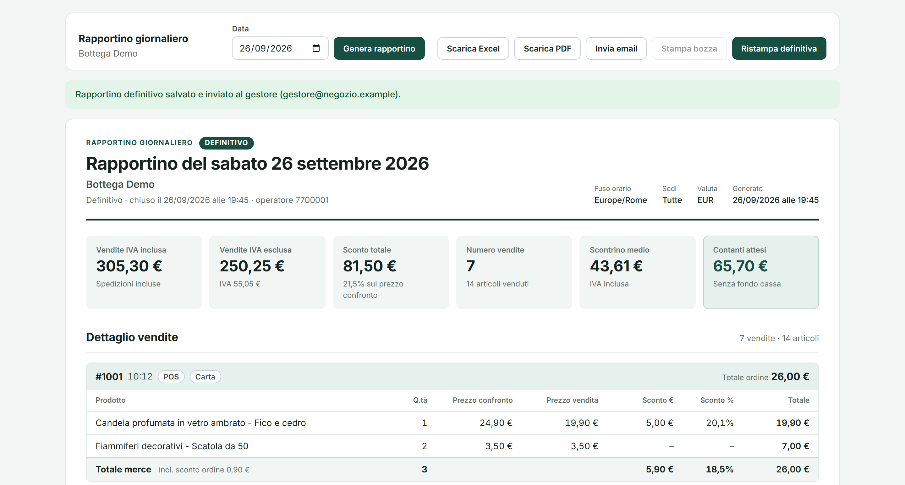
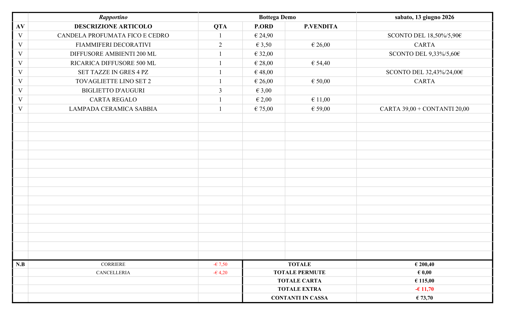
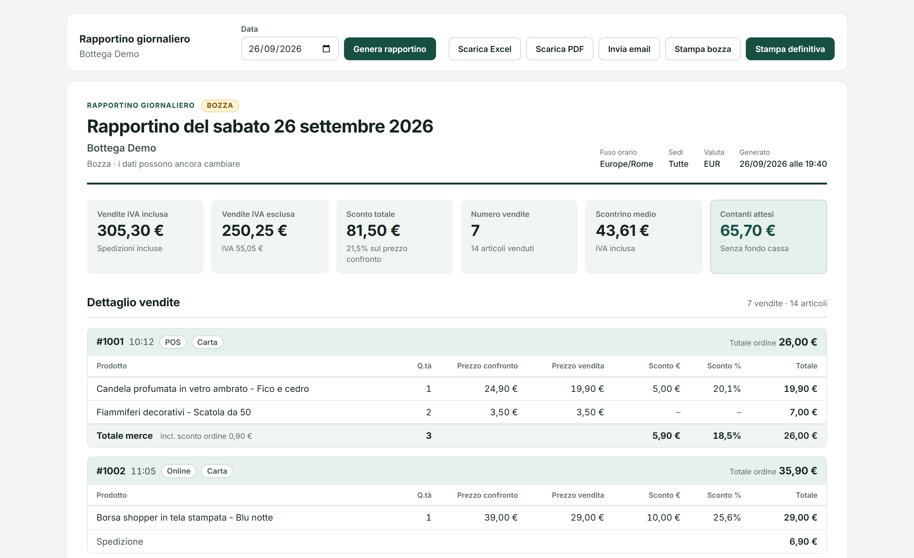
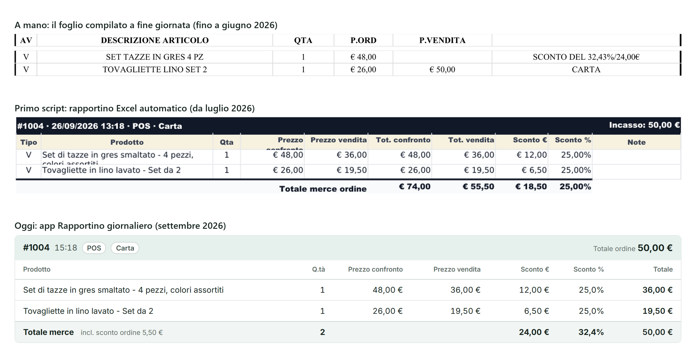
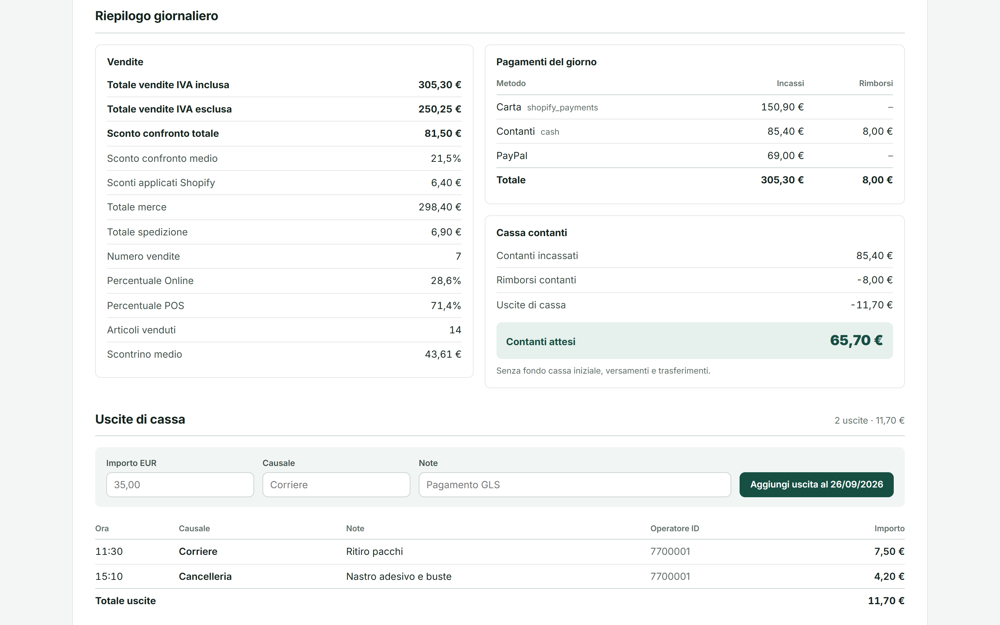
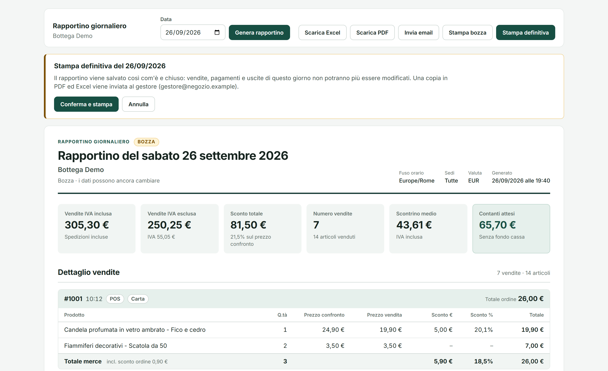
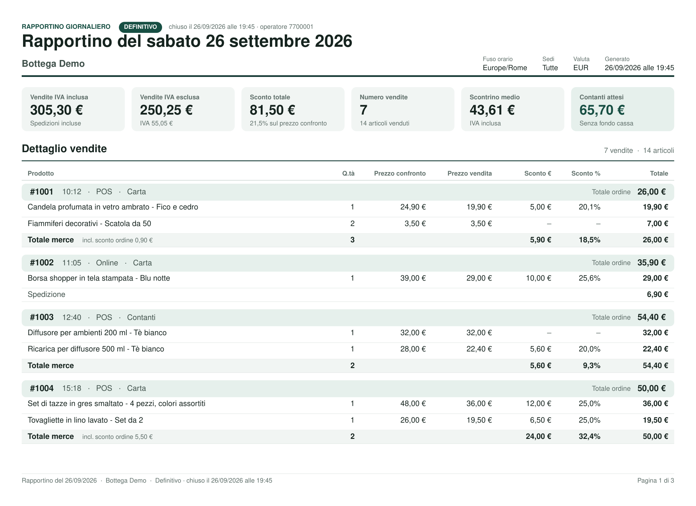
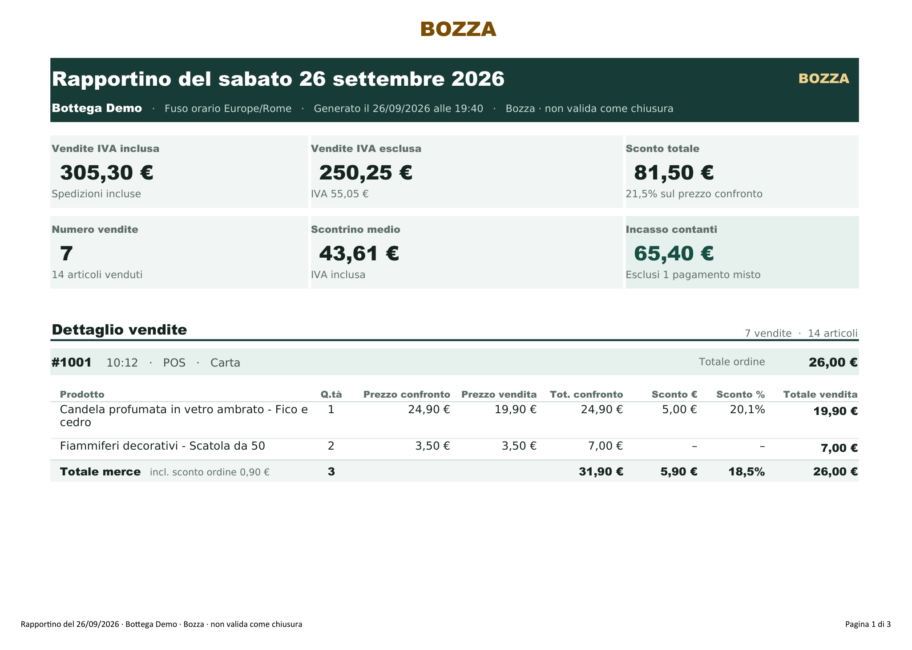

# Rapportino giornaliero

[Italiano](README.md) | **English**

The end-of-day sales report (*rapportino*) for shops that sell with Shopify POS: once typed into Excel by hand, now generated from Shopify orders, closed as final and sent to the manager automatically.

## The problem

In four shops, at the end of every day, staff typed the day's sales into an Excel sheet by hand, one by one, saved the file and emailed it to the owner or manager. It took 20 minutes on average, longer on busy days. The sheet kept losing its formulas and formatting, and with them the correct total; it had no KPIs, and the file that was sent could still be edited by anyone.

## The solution

1. **Sales on Shopify POS.** I set up a tablet with Shopify POS: every sale is recorded with products, prices, discounts and payment method.
2. **First script, July 2026.** A Python script generates the report in Excel straight from the day's orders.
3. **Shopify app and updated script, September 2026.** An app inside the Shopify Admin shows the report, exports it to PDF and Excel, records cash expenses and calculates the expected cash. The final print closes the day and sends the PDF and Excel files to the manager. The Python script got the same design and the same rules. Today the app is used every day in the store.

The document is still the one the staff knew: one sale after another, cash totals at the bottom. Where it used to take 20 minutes, it now takes one click, plus a confirmation for the final close.

## Before and after

| The hand-filled sheet (rebuilt with made-up data) | Today's report |
| --- | --- |
|  |  |

The same sale in three steps: typed by hand, in the first script (UTC time, order discount lost) and in the app (local time, totals that add up).

Interface and documents are in Italian, as used in the shops.

## What it does

- **Daily report from Shopify orders**, in the shop's time zone: 6 KPIs, one card per sale with prices, discounts and payment, and a summary with the day's payments and the cash drawer.
- **Totals that add up.** Order-level discounts are included in the merchandise total; cash comes from the actual transactions, including split card and cash payments; refunds and cash expenses are subtracted from the expected cash.
- **Draft and final.** The draft can be printed as often as needed and is marked BOZZA (draft) on screen, in the PDF and in Excel. The final print saves a copy that can no longer be changed, not even in the database, blocks new expenses for that day and can only be reprinted.
- **Automatic email to the manager** at closing, with the PDF (printable but not editable) and the Excel file (protected sheets). If delivery isn't confirmed, the app says so and allows a resend without duplicates.
- **One design, three formats:** printable A4 landscape page, PDF and Excel with the same palette and no sale split across two pages.
- **Python script** for the same procedure from the command line: `--stampa bozza` (draft) or `--stampa definitiva` (final), with a register and a SHA-256 fingerprint of every final report.

| Summary and cash drawer | Final print confirmation |
| --- | --- |
|  |  |
| **Final PDF sent to the manager** | **Python script Excel (draft)** |
|  |  |

All images are in [`docs/screenshots`](docs/screenshots).

## How it's built

| Folder | Contents |
| --- | --- |
| [`shopify-app/`](shopify-app) | Shopify app embedded in the Admin: Remix 2.17, React 18, TypeScript, Admin GraphQL API 2026-07, PostgreSQL with Prisma 6, ExcelJS and PDFKit for exports, nodemailer for email, Vitest (32 tests). |
| [`python-script/`](python-script) | Python 3 script with openpyxl: the same report in Excel, SMTP delivery to the manager and printing on the default printer. |
| [`docs/screenshots/`](docs/screenshots) | Project images with made-up data. |

Some technical choices:

- The final close runs in a transaction holding a PostgreSQL lock per shop and day, shared with expense recording: two clicks or two operators can't produce two different copies.
- A PostgreSQL trigger prevents final reports from being changed or deleted; only the email status can still be updated.
- The day is computed in the shop's time zone; refunds made today on earlier orders count toward today.
- Amounts are handled as integer cents, with decimal.js for rounding.

## Getting started

- **App:** full instructions in [`shopify-app/README.md`](shopify-app/README.md), in Italian (Node 22, PostgreSQL, Shopify CLI).
- **Script:** instructions in [`python-script/README.md`](python-script/README.md), in Italian (Python 3.11+, `pip install -r requirements.txt`, a `.env` file created from `.env.example`).

Credentials go only in the `.env` files, which git ignores.

## Status

- **In production:** the app has been tested on the Shopify store and is used every day to close the day. The automated report is in use in four shops.
- **Tests:** 32 automated tests covering calculations, the final close, API and exports. Verifications and open advisories on third-party libraries are documented in [`TEST_RESULTS.md`](shopify-app/TEST_RESULTS.md) and [`SECURITY.md`](shopify-app/SECURITY.md), in Italian.
- Known limits: EUR only, expected cash without the opening float, compare-at price taken from the current catalog rather than at the time of sale.

## Data

There is no real data in this repository: the shop, products, amounts and operators shown in the images are made up.

## Author

Aniello Nasti ([@monellonasti](https://github.com/monellonasti)): process analysis, Shopify POS tablet setup, report design, app and script development, with help from Claude Code.

## License

All rights reserved © 2026 Aniello Nasti. The code is published to showcase the project: it may not be reused, in whole or in part, without the author's written permission.
